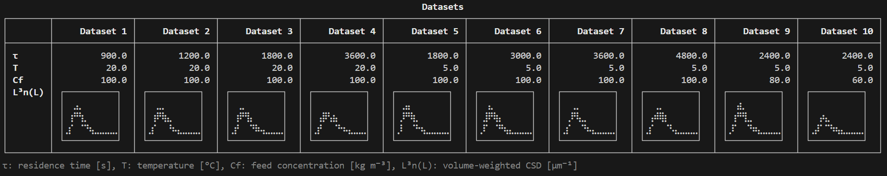
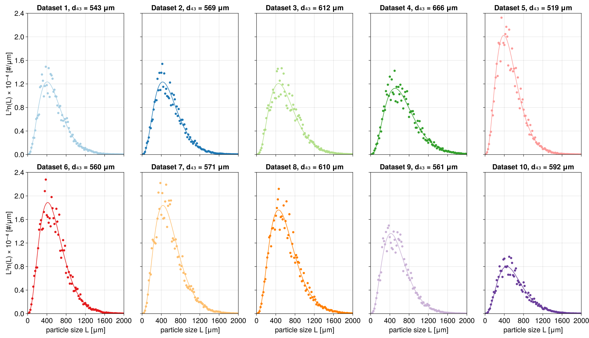
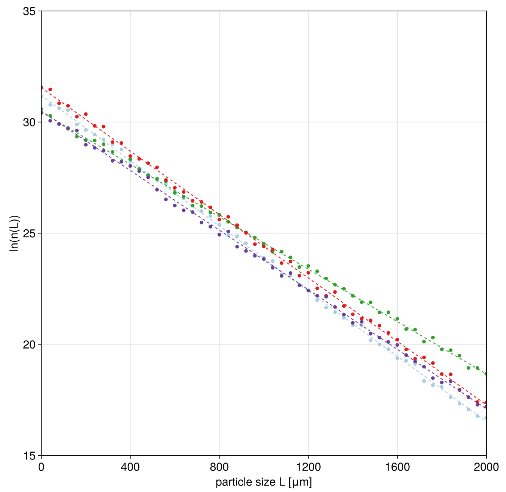

```@meta
CurrentModule = AttainableRegionTutorial
```

# Tutorial

## Background: Mixed Suspension Mixed Product Removal Crystallizer Model

In this tutorial we will detail how attainable regions can be computed for a single mixed 
suspension mixed product removal (MSMPR) crystallizer at steady state. The population balance 
equation describing the crystal size distribution in an MSMPR crystallizer governed by 
nucleation and growth can be written as:
```math
\frac{\partial n(L,t)}{\partial t} = -\frac{\partial G(S,T)n(L,t)}{\partial L} - \frac{n(L,t)}{\tau}
```
where ``n(L,t)`` is the crystal size distribution, such that ``n(L,t)\mathrm{d}L`` is the 
number of crystals with sizes between ``L`` and ``L+\mathrm{d}L`` per volume of solution 
(it therefore has units of ``[m^{-4}]``). ``t`` is time, ``L`` is crystal size, ``G(S,T)`` 
is the supersaturation- (``S``) and temperature-dependent (``T``) growth rate 
(in ``[m s^{-1}]``) and ``\tau`` is the mean residence time of the crystallizer (determined 
by the ratio of the volume of solution inside the crystallizer, ``V``, and the flow rate of 
the particle-free inlet, ``Q`` [``m^3 s^{-1}``]). With the typical assumption that nucleation 
occurs at negligibly small particle size (treated as ``L=0``), a boundary condition 
``n(L=0,t) = J(S,T,M_\mathrm{T})/G(S,T)`` completes the description of the crystal phase in 
the crystallizer.

At steady state and with a growth rate that is not size-dependent, this becomes:
```math
0 = -G(S,T)\frac{\mathrm{d} n(L)}{\mathrm{d} L} - \frac{n(L)}{\tau}
```
This is a separable first order differential equation and thus can be directly solved to 
obtain:
```math
n(L) = \frac{J(S,T,M_\mathrm{T})}{G(S,T)}\exp\left(-\frac{L}{G\tau}\right)
```
The nucleation and growth rates need to be calculated at the steady state concentration in 
the crystallizer. This couples the liquid phase and the crystalline phase to each other via
the overall mass balance:
```math
C_\mathrm{f} = M_\mathrm{t} + C_\mathrm{ss} 
```
where ``C_\mathrm{f}`` is the feed concentration, TODO ETC.

```math
M_\mathrm{t} = k_\mathrm{v}\rho_\mathrm{c}\int\limits_0^\infty L^3 n(L) \mathrm{d} L 
```

## Overview
The tutorial proceeds in a step-wise fashion th

## Generation of synthetic data using a specified model

We start out by defining a description of the "system" we are crystallizing. This includes 
defining material constants, such as the crystal density and the volumetric shape factor, as 
well as defining an expression of the solubility against temperture and the kinetics of 
nucleation and crystal growth.

As outlined in the book chapter, we will use 
[Power et al. (2015)](https://www.sciencedirect.com/science/article/abs/pii/S0009250915001207)


[Supplying custom kinetics and thermodynamics](@ref)

```julia
using AttainableRegionTutorial

#Initialize System
system = SystemSpecification()
```

```@raw html

```

```julia
#generate dataset
residencetimes = [15.0, 20.0, 30.0, 60.0, 30.0, 50.0, 60.0, 80.0, 40.0, 40.0].*60 #converted to seconds
temperatures = [20.0, 20.0, 20.0, 20.0, 5.0, 5.0, 5.0, 5.0, 5.0, 5.0]
feedconcentrations = [100.0, 100.0, 100.0, 100.0, 100.0, 100.0, 100.0, 100.0, 80.0, 60.0]
dataset = Dataset(residencetimes, temperatures, feedconcentrations, system)
```

After executing the last command, you will see a summary of the dataset, as shown below. 
Note that the Unicode ("dot") plots show volume-weighted crystal size distributions (CSDs) 
and are meant to provide a quick overview of the CSDs contained within the dataset. They are 
depicted to scale, i.e., broader distributions have lower peaks and lower areas below the 
curves represent lower suspension densities.



While nice, we may want to have some more professional looking plots of the CSDs. We first 
recreate the figure depicting the CSDs as shown in the book chapter.

```julia
#make plot of data
#Re-create tutorial figure 
fig = plotCSDs(dataset, system, ids = [1,4,6,10])
```

```@raw html

```

```julia
#Now plot all the data in separate plots
fig2 = plotCSDs(dataset, system, mode = :separate, figure = (fontsize = 20, 
    figure_padding = 30))
```



## Estimating parameters: fitting a model to the synthetic data
We will now estimate the kinetic parameters from the dataset. For this purpose, we are using 
the function `estimateParameters()`. We will run this with the default values in this case,
but see the page [Tuning parameter estimation](@ref) for ways to tune the parameter 
estimation procedure. Also consult the docstring of the `estimateParameters` function by 
writing `?estimateParameters` in your Julia session.

```julia
estsystem = estimateParameters(system, dataset)
conditions, d43, P = generateAttainableRegion(estsystem, npointstemperature = 50, npointsfeedconc = 50,
        npointsresidencetime = 50)
```
`estsystem` should be a new system specification that contains the estimated parameters, which 
will be shown in the Julia session. It should look like this:
```@raw html

```

Note that the precise values may be slightly different based on the optimizer used when 
estimating the parameters and also on the precise noise added when generating the dataset 
above.

During the estimation procedure you will likely encounter warnings like this:
```julia
┌ Warning: The interval is not an enclosing interval, opposite signs at the boundaries are required.
└ @ BracketingNonlinearSolve C:\Users\thvt\.julia\packages\BracketingNonlinearSolve\Ucmxz\src\itp.jl:87
```
These are nothing to be concerned about. They stem for the particular way the root finding 
problem required to solve the PBE and mass balance together is implemented. For a deeper 
explanation, see [Solving root finding problem](@ref)

```julia
#Plot quality of fit
#Re-create tutorial figure 
fig3 = plotFitQuality(estsystem, dataset, ids = [1,4,6,10], mode = :combined, 
    axislegend = false)
```



```julia
#Or plot all data
fig4 = plotFitQuality(estsystem, dataset, mode = :separate)
```

TODO: insert plot with the separate fit qualities.

## Generating an attainable region
We can now proceed to populate the attainable region by varying process conditions. The 
`generateAttainableRegion` function allows to do this in an easy manner. Specifically, we 
vary the temperature in the crystallizer, the feed concentration, as well as the residence 
time. By default, the function selects reasonable ranges for these values for this case 
study. More information on this can be obtained by typing `?generateAttainableRegion` in the 
Julia session or by considering the relevant page in the documentation [generateAttainableRegion](@ref). 
The function will return volume-weighted mean particle sizes at each operating point, `d43` 
in [m], as well as productivity values `P` in [``\mathrm{kg} \mathrm{m}^{-3} \mathrm{s}^{-1}``].

```julia
#Generate data for the attainable region
conditions, d43, P = generateAttainableRegion(estsystem, npointstemperature = 50, npointsfeedconc = 50,
        npointsresidencetime = 50)
```
Note that we have intentionally reduced the number of points investigated, so that the code 
finishes running quicker. The output in the book chapter was generated using ``200 \times 200 \times 200`` 
points. 

We can now plot all attainable combinations of mean particle sizes against productivity 
values in a static plot.

```julia
#Plot attainable region
#static plot for the tutorial.
```

In order to explore which operating condition generates which point in the attainable region, 
there is a dynamic analysis tool available:
```julia
#dynamic plot for exploring
fig6 = plotAttainableRegion_dynamic(system, conditions, d43, P)
```

`fig6` is an interactive figure. By left-clicking on specific points in the attainable 
(left) region plot, the volume-weighted CSD and the operating policy generating it are 
displayed in the middle and right plot, respetively. Multiple points can be compared using 
multiple left-clicks (up to a maximum of 5 - more clicks result in previously selecting point 
getting deselected). The functionality is showcased in the video below:

TODO: insert video showing the dynamic functionality